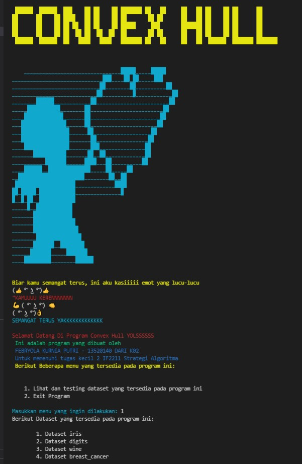

# Implementasi Convex Hull untuk Visualisasi Tes Linear Separability Dataset dengan Algoritma Divide and Conquer
Tugas Kecil 2 IF2211 Strategi Algoritma Semester II Tahun 2021/2022

Menyelesaikan Permasalahan Convex Hull Dengan Menggunakan Algoritma Divide and Conquer

## Table of Contents
* [General Information](#general-information)
* [Requirement](#requirement)
* [Setup](#setup)
* [Organogram](#organogram)
* [Message](#message)
* [Contact](#contact)

## General Information
  Program sederhana convex hull yang ditulis dalam bahasa python ini bertujuan untuk memecahkan
  permasalahan convex hull dengan menggunakan algoritma divide and conquer. Himpunan titik pada bidang planar disebut convex jika untuk sembarang dua titik pada bidang tersebut (misal p dan q), seluruh segmen garis yang berakhir di p dan q berada pada himpunan tersebut. jadi nantinya program
  ini akan mengembalikan titik-titik dalam bentuk convex hull dimana akan terbentuk convex hull yang
  akan di plot dengan menggunakan library yang terdapat pada  python, yaitu matplotlib

## Requirement
Pastikan Anda telah mendownload dan menginstall semua package berikut ini:
lakukan pip install "nama package"
1. matplotlib==3.5.1
2. numpy==1.22.2
3. pandas==1.4.1
4. scikit-learn==1.0.2

## Setup
Program dapat dicompile secara online melalui jupyter notebook (ipynb) ataupun di terminal teks editor seperti vs code dan akan menampilkan contoh output seperti berikut ini:

Pada output tersebut akan ditampilkan menu utama program, dan pada menu terdapat
pilihan-pilihan dataset yang dapat digunakan pada program ini. Tinggal jalankan
file mainProgram.py maka program akan berjalan dan dapat menampilkan figure dari convex hull yang dipilih. Saat memilih menu, maka user akan diminta untuk menginputkan beberapa hal berikut:
1. memilih dataset
2. memasukkan kolom dan pasangan kolom yang ingin dicari convex hullnya
3. memasukkan namafile karna program ini dapat menyimpan file yang sudah difigure
   dan akan masuk ke folder output
4. file yang masuk pada folder output akan langsung 2, yaitu file dari convex hull python dengan
   tambahan nama "python dibelakangnya" dan file convexhull buatan sendiri
   contoh penamaanya adalah yola.png dan yolapython.png yang sudah terdapat pada folder output
5. program juga akan difigure secara langsung
6. silakan tekan x pada figure maka program akan berakhir
7. SELAMAT MENCOBA

Untuk dapat menjalankan program ini sangat mudah:
1. Menggunakan ipynb (jupyter notebook) pastikan sudah terinstall di pc Anda
2. tinggal masukkan daftar dataset testcase yang sudah disediakan pada file
   src/VisualisasiConvexHull.ipynb dan dapat langsung dijalankan
3. Bisa juga dijalankan menggunakan terminal seperti vs code
4. Sebelum itu pastikan python 3 sudah terinstall pada pc Anda
   dan ekstension python sudah dapat dijalankan
5. lalu install semua dependency yang diperlukan dengan menggunakan command
   "pip install ..." 
6. ... dapat diisi dengan modul yang diperlukan seperti numpy dan ipynb
7. Cara menggunakan terminal ini telah dijelaskan pada poin sebelumnya, contohnya berikut:

## Organogram
1. output = berisikan file jpg dari figure yang ditesting 
  terdapat 2 file, yaitu file convexhull buatan sendiri dan file convexhull dari python
2. test = berisi file test.txt yang berisikan dataset yang digunakan pada testing
3. readme
4. src
 - Function.py = berisi fungsi-fungsi dasar pembentuk MyConvexHull
 - MyConvexHull.py = fungsi utama MyConvexHull
 - mainProgram.py = program utama
 - VisualisasiConvexHull.ipynb = visualisasi data dalam bentuk ipynb
 
## Message
Tucil oh tucillllllllll
asikk bangett bisa ada tugas dan bisa implementasiin materi yang ada di kelas secara langsung
apalagi pake python karna terakhir kali pake python kayanya waktu TPB :D
Buat kakak2 asisten yang baca readme ini semangat kuliahnya yahh!!

## Contact
This program was made by Febryola Kurnia Putri (13520140).
email : 13520140@std.stei.itb.ac.id
